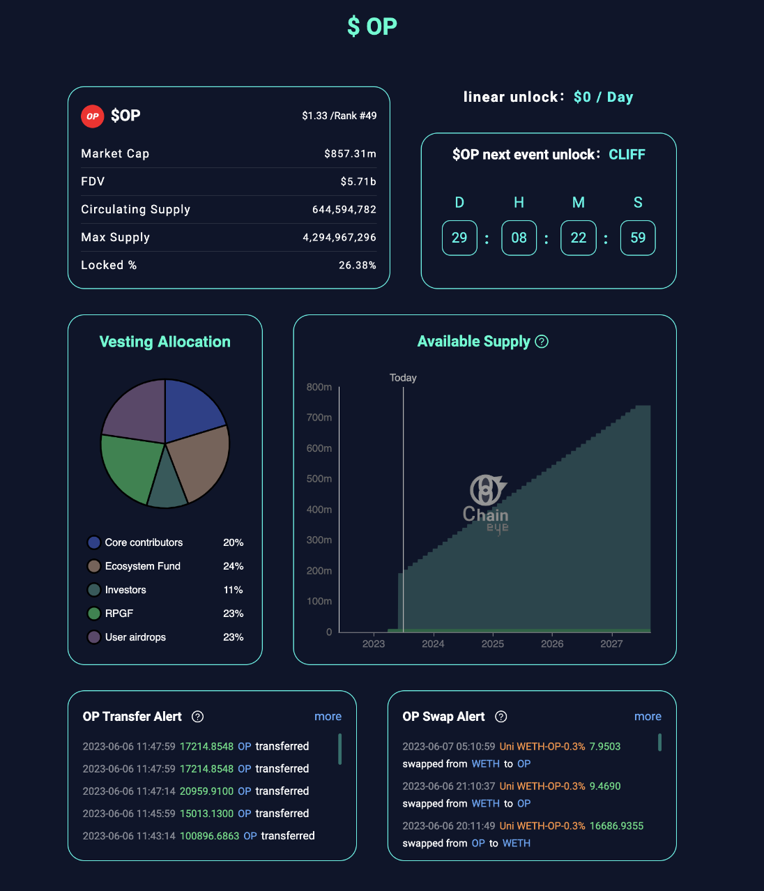

# ETHShanghai-Cryptohunt

This is a project for ETHShanghai Hackathon. Team Cryptohunt

Building a crypto token monitor (transfer, swap, etc.) app leveraging Chainbase API

API endpoints we are using in this version includes:
- eth_blockNumber
- eth_getBlockByNumber
- eth_newFilter
- eth_getFilterChanges

